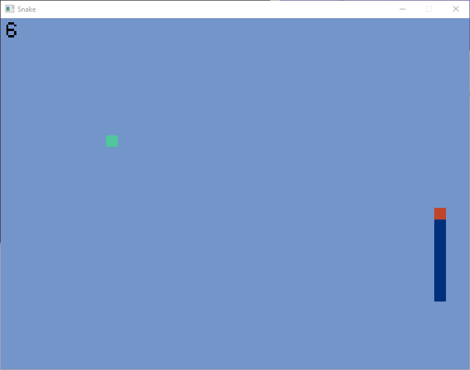

## Snake Game  
------
**Description:**  
A snake game wrote in C using SDL2 libraries  

------
**Dependencies:**  
1. SDL2.h  
2. SDL2_ttf.h  
3. Regular C libraries(I use MinGW)
4. SDL2.dll    

------
**How to compile:**  
```bash
gcc game.c Linked.c -o run `sdl2-config --cflags --libs` -lSDL2_ttf
```  
Based on your OS, you may have to change the header file `#include "SDL2/SDL.h"` to `#include "SDL.h"` as well as the `SDL_ttf.h` file  

After that, execute `./run`

------
**KeyBoard Control:**  
`Esc` -> exit the window  
`up` or `W` -> move up  
`Down` or `S` -> move down  
`Left` or `A` -> move left  
`Right` or `D` -> move right  

------
**Sample Image:**  
  

------
**Problems:**  
1. The direction changing is not very good, because it can only be changed if the head is on the grid(x=0, 20, 40... and y=0, 20, 40...)  
2. Besides Windows10 and Raspbian, I haven't tried it on other OS  
3. The game has no sound effects  
4. There's only two types of food for snake  
5. I haven't wrote anything to support a game controller  

------
**How I made it:**  
1. For the snake body, I create a customized linked list to save the x and y value for each part of the body  
2. I set every part of the body with a direction, when the direction of a node changes, it will pass its former value to its Child. So that the snake can move fluently. I made this possible by creating a list and store the present and former values of a node  
3. For the collision with itself(which seems quite hard for me), I set the detection point center of the head's side which its head direction goes. Then after the body length is greater than 3, I will check every part after 3 and see if the detection point is in the area of the body  

------
Motivated by a series of [YouTube tutorials](https://www.youtube.com/playlist?list=PLT6WFYYZE6uLMcPGS3qfpYm7T_gViYMMt) about game programming using C, and the YouTuber [VertoStudio3D](https://www.youtube.com/channel/UCPsK6vduM-ZqbszTuzNJrcQ)